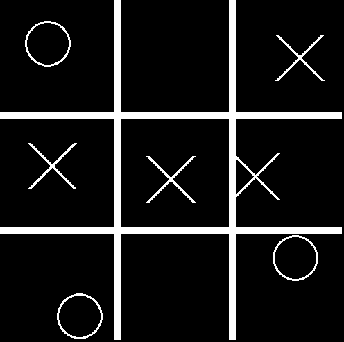

# Gatito


Un juego de el gato que hice
Lo hice mas que nada para hacer una IA que lo juege, antes tenia que hacer el juego
## Instalacion
Para poder ejecutar este codigo necesitas instalar las librerias necesarias.
La mayoria ya vienen instaladas
```bash
$ pip install pygame
```
Copia el repositorio de github de el codigo y accede a el
```bash
$ git clone https://github.com/zeusdh/Gatito.git
$ cd Gatito/
```
Ejecuta el codigo.
En algunos casos es asi
```bash
$ python script.py
```
En otros sera asi
```
$ python3 script.py
```
